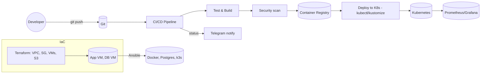

```mermaid
flowchart LR
  Dev((Developer)) -->|git push| Repo[(Git)]
  Repo --> CI[CI/CD Pipeline]
  CI --> B[Test & Build]
  B --> S[Security scan]
  S --> R[(Container Registry)]
  R --> D[Deploy to K8s - kubectl/kustomize]
  D --> K8s[(Kubernetes)]
  K8s --> Mon[(Prometheus/Grafana)]
  CI -->|status| Tg[Telegram notify]

  subgraph IaC
    TF[Terraform: VPC, SG, VMs, S3] --> VMs[(App VM, DB VM)]
  end
  VMs -->|Ansible| Cfg[(Docker, Postgres, k3s)]
```
