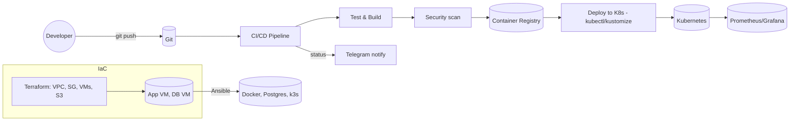

## Разработка инфраструктуры и CI/CD пайплайна для развертывания приложения
**Реализуем подход IaC:** один репозиторий → пайплайн собирает контейнер Spring Boot-сервиса, прогоняет тесты и безопасность, публикует образ в реестр, применяет манифесты K8s, уведомляет в Telegram.  
**Инфраструктура:** создаётся Terraform’ом
- VPC, и внутри подсети двух типов (приватные для БД и публичные для приложения)
- security groups: к веб-приложению разрешим доступ только по HTTPS, к базе данных — только с адреса приложения, а административный доступ по SSH ограничим IP-адресами разработчиков или VPN-шлюза
- 2 отдельные виртуальные машины на приложения и БД 
	- app-VM - установлен Docker и Kubernetes
	- DB-VM - сервер для базы Postgres. Чтобы сбой в приложении не затрагивал данные
- S3-совместимое хранилище артефактов
Конфигурирование хостов — Ansible (Docker, Postgres, k3s/агент)

**Безопасность и соответствие текущей системе:**  
- внешние запросы идут через API-шлюз (Kong), аутентификация/авторизация - OAuth2.1 + OIDC (Keycloak), проверка JWT на шлюзе и политик через OPA; секреты и ключи в Vault, ротация ключей включена - это согласовано с security-дизайном.
- внутренняя связь сервисов - HTTP/2 (REST), gRPC и Kafka; для стриминга статусов - WebSocket/SSE. Метрики/трейсинг - повсюду. Это мы используем и в пайплайнах (health-checks, canary и т.д.).
- мониторинг - Prometheus + Grafana + Alertmanager

### Почему Terraform и Ansible
При проектировании мы разделяем задачи:
- **Terraform** используем для **создания инфраструктуры**: сетей, виртуальных машин, хранилищ, security groups. Его сильная сторона - работа с облачными провайдерами и декларативное описание ресурсов. 
	- state храним в S3-бакете с блокировкой (MinIO-lock)
- **Ansible** используем для **настройки готовых машин**: установки пакетов, конфигурации сервисов, подготовки окружения приложения. Его сильная сторона - идемпотентность и удобная работа с конфигурациями. Ansible хорошо подходит там, где нужно что-то настроить внутри сервера

Таким образом, Terraform отвечает за железо и облачные ресурсы, а Ansible — за то, что внутри этих ресурсов (ПО и конфигурации)
##### Terraform конфиг `terraform/main.tf` 
```json
terraform {
  required_version = ">= 1.6"
  backend "s3" {
    bucket = "ci-artifacts"
    key = "terraform/state/infra.tfstate"
    region = "us-east-1"
    endpoint = var.s3_endpoint  # для MinIO
    skip_credentials_validation = true
    skip_requesting_account_id  = true
  }
}

provider "aws" {
  region = "us-east-1"
  access_key = var.s3_access_key
  secret_key = var.s3_secret_key
  s3_force_path_style = true
  skip_credentials_validation = true
  endpoints {
    s3 = var.s3_endpoint
  }
}

module "network" {
  source = "./modules/network"
  cidr_block = "10.10.0.0/16"
}

module "security" {
  source = "./modules/security"
  vpc_id = module.network.vpc_id
}

module "compute" {
  source = "./modules/compute"
  vpc_subnet_id_pub = module.network.pub_subnet_id
  vpc_subnet_id_priv = module.network.priv_subnet_id
  sg_app_id = module.security.sg_app_id
  sg_db_id = module.security.sg_db_id
  key_name = var.ssh_key_name
}

module "s3_artifacts" {
  source = "./modules/s3"
  name = "ci-artifacts"
  versioning = true
}
```
##### Ansible конфиг
**Что создаём**
- **common**: пакеты, таймзона, sysctl, user, firewall.
- **docker**: установка Docker + Compose plugin.
- **postgres** (только на db-vm): установка, initdb, создание пользователя/схемы.
- **k3s** (на app-vm): лёгкий Kubernetes
- **deploy**: login в реестр, запуск стека (k8s apply).
`inventory.ini`
```
[app]
app-vm ansible_host=APP_VM_IP ansible_user=ubuntu

[db]
db-vm ansible_host=DB_VM_IP ansible_user=ubuntu
```

`playbooks/site.yml`
```
- hosts: all
  become: true
  roles: [common, docker]

- hosts: db
  become: true
  roles: [postgres]
  vars:
    postgres_version: "14"
    pg_db: appdb
    pg_user: appuser
    pg_password: "{{ lookup('env','APP_DB_PASS') | default('change_me') }}"

- hosts: app
  become: true
  roles: [k3s, deploy]
```
### Контейнеризация
- multi-stage - чтобы образ был меньше и безопасней
	- первая стадия использует JDK для сборки (нужен Maven/Gradle и компилятор Java), вторая стадия берёт только скомпилированный jar и запускает его на JRE
- Healthcheck (Docker): используется только при локальном запуске контейнера/в Docker Compose. В Kubernetes он игнорируется — для K8s применяются readinessProbe, livenessProbe и при необходимости startupProbe
```dockerfile
# --- build stage ---
FROM eclipse-temurin:17-jdk AS build
WORKDIR /app
COPY mvnw pom.xml ./
COPY .mvn .mvn
RUN ./mvnw -q -DskipTests package || true
COPY src src
RUN ./mvnw -q -DskipTests package

# --- runtime stage ---
FROM eclipse-temurin:17-jre
ENV APP_USER=appuser
RUN useradd -m ${APP_USER}
WORKDIR /opt/app
COPY --from=build /app/target/app.jar ./app.jar
EXPOSE 8080
USER ${APP_USER}
HEALTHCHECK --interval=30s --timeout=3s CMD curl -fs http://localhost:8080/actuator/health || exit 1
ENTRYPOINT ["java","-jar","./app.jar"]
```
### Kubernetes
- **Почему K8s:** промышленный стандарт для управления контейнерами. Позволяет:
	- автоматически перезапускать контейнеры при сбое;
	- масштабировать приложение при росте нагрузки;
	- разворачивать обновления постепенно (rolling updates).
- приложение запускается как минимум в двух копиях → отказоустойчивость
- `readinessProbe` и `livenessProbe` — Kubernetes понимает, когда контейнер готов обслуживать запросы и когда его нужно перезапустить
- `env.valueFrom.secretKeyRef` — доступ к базе через секреты, а не хардкод
`k8s/deployment.yaml`
```yaml
apiVersion: apps/v1
kind: Deployment
metadata:
  name: app
  labels: {app: app}
spec:
  replicas: 2
  selector: {matchLabels: {app: app}}
  template:
    metadata: {labels: {app: app}}
    spec:
      containers:
        - name: app
          image: ghcr.io/your-org/your-app:${GIT_SHA}
          ports: [{containerPort: 8080}]
          env:
            - name: SPRING_DATASOURCE_URL
              valueFrom: {secretKeyRef: {name: app-secrets, key: jdbc_url}}
            - name: SPRING_DATASOURCE_USERNAME
              valueFrom: {secretKeyRef: {name: app-secrets, key: db_user}}
            - name: SPRING_DATASOURCE_PASSWORD
              valueFrom: {secretKeyRef: {name: app-secrets, key: db_pass}}
          readinessProbe:
            httpGet: {path: /actuator/health/readiness, port: 8080}
            initialDelaySeconds: 10
          livenessProbe:
            httpGet: {path: /actuator/health/liveness, port: 8080}
            initialDelaySeconds: 30
```

`k8s/service.yaml`
`type: ClusterIP` — сервис доступен только внутри кластера, для внешнего мира его открывает Ingress. Это повышает безопасность.
```yaml
apiVersion: v1
kind: Service
metadata:
  name: app
spec:
  type: ClusterIP
  selector: {app: app}
  ports:
    - port: 80
      targetPort: 8080
```

`k8s/ingress.yaml`
- используется для публикации сервиса наружу по HTTPS-домену;
- в аннотациях указываем плагины (например, JWT-валидацию и OPA-политики в Kong);
- это позволяет вынести проверку токенов и авторизацию из приложения в шлюз, разгружая код и повышая унификацию политики доступа.
```yaml
apiVersion: networking.k8s.io/v1
kind: Ingress
metadata:
  name: app
  annotations:
    konghq.com/plugins: jwt,opa-authz
spec:
  ingressClassName: kong
  rules:
    - host: app.example.com
      http:
        paths:
          - path: /
            pathType: Prefix
            backend: {service: {name: app, port: {number: 80}}}
```
### CI/CD
- GitHub Actions
	- Бесплатные раннеры для публичных репозиториев, простая интеграция с GitHub.
	- Поддержка секретов и OpenID Connect для безопасного доступа к внешним системам.
	- Легко перенести в GitLab CI или Jenkins, так как этапы пайплайна стандартные
- jobs: 
	- сборка и юнит-тесты (проверка качества)
	- формирование и публикация образа (в т.ч. проверка безопасности)
	- деплой - применяем манифесты k8s
	- уведомления - отправляем в тг статус пайплайна
```yaml
name: ci-cd
on:
  push:
    branches: [ main ]
  pull_request:

env:
  REGISTRY: ghcr.io/your-org
  IMAGE_NAME: your-app

jobs:
  test:
    runs-on: ubuntu-latest
    steps:
      - uses: actions/checkout@v4
      - uses: actions/setup-java@v4
        with: { distribution: 'temurin', java-version: '17' }
      - name: Unit tests
        run: ./mvnw -q test

  build-and-push:
    needs: test
    runs-on: ubuntu-latest
    permissions: { contents: read, packages: write }
    steps:
      - uses: actions/checkout@v4
      - name: Login to GHCR
        uses: docker/login-action@v3
        with: { registry: ghcr.io, username: ${{ github.actor }}, password: ${{ secrets.GITHUB_TOKEN }} }
      - name: Build
        run: |
          docker build -t $REGISTRY/$IMAGE_NAME:${{ github.sha }} .
      - name: Trivy scan
        uses: aquasecurity/trivy-action@0.24.0
        with:
          image-ref: ${{ env.REGISTRY }}/${{ env.IMAGE_NAME }}:${{ github.sha }}
          format: 'table'
          exit-code: '1'
          ignore-unfixed: true
      - name: Push image
        run: docker push $REGISTRY/$IMAGE_NAME:${{ github.sha }}

  deploy:
    needs: build-and-push
    runs-on: ubuntu-latest
    if: github.ref == 'refs/heads/main'
    steps:
      - uses: actions/checkout@v4
      - name: Setup kubectl
        uses: azure/setup-kubectl@v3
      - name: Kubeconfig
        run: |
          mkdir -p $HOME/.kube
          echo "${{ secrets.KUBECONFIG }}" > $HOME/.kube/config
      - name: Set image tag
        run: |
          sed -i "s|\${GIT_SHA}|${{ github.sha }}|g" k8s/deployment.yaml
      - name: Apply manifests
        run: |
          kubectl apply -f k8s/

  notify:
    needs: [test, build-and-push, deploy]
    if: always()
    runs-on: ubuntu-latest
    steps:
      - name: Telegram notify
        env:
          TG_TOKEN: ${{ secrets.TG_TOKEN }}
          TG_CHAT:  ${{ secrets.TG_CHAT }}
        run: |
          STATUS=${{ needs.deploy.result }}
          curl -s -X POST https://api.telegram.org/bot$TG_TOKEN/sendMessage \
          -d chat_id=$TG_CHAT -d text="CI: $GITHUB_REPOSITORY @ $GITHUB_SHA → $STATUS"
```
### Мониторинг, логи и отчёты
- **Метрики**: экспортеры и `/actuator/prometheus`, собираем p50/p90/p99, error-rate, retry-rate, RPS — именно эти метрики у тебя заложены как ключевые.
- **Логи**: Fluent Bit → Loki/ELK; исключаем PII, токены не логируем (политика безопасности).
- **Алерты**: Alertmanager → Telegram (та же пара bot token/chat id, что и в CI)
- **Трейсинг**: W3C Trace-Context/`trace_id` пробрасываются через шлюз
## Инструкция по запуску

1. **Инфраструктура**

```bash
cd terraform 
export AWS_ACCESS_KEY_ID=... 
export AWS_SECRET_ACCESS_KEY=... 
export TF_VAR_s3_endpoint=https://minio.example.com 
terraform init && terraform apply
```

2. **Конфигурация хостов**

```bash
cd ansible 
export APP_DB_PASS=choose-strong-pass 
ansible-playbook -i inventory.ini playbooks/site.yml
```

3. **Docker-образ локально (опционально)**
```bash
docker build -t ghcr.io/org/app:dev . 
docker run -p 8080:8080 ghcr.io/org/app:dev
```

4. **Kubernetes**

```bash
kubectl apply -f k8s/ 
kubectl get pods,svc,ingress
```

5. **CI/CD**
	- В репозитории добавить секреты: `KUBECONFIG`, `TG_TOKEN`, `TG_CHAT`.
	- Пуш в `main` запускает пайплайн → результат и алерты приходят в Telegram.