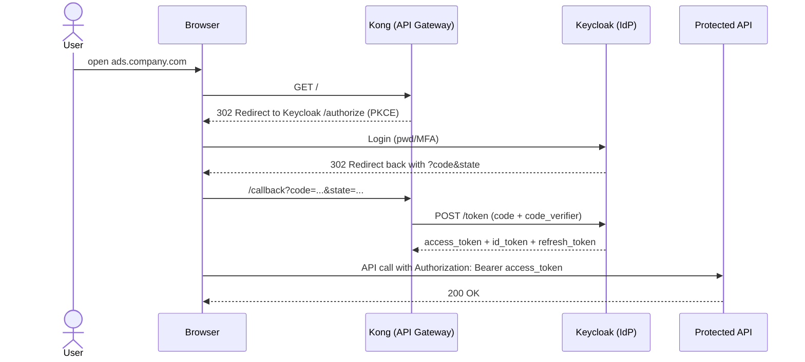
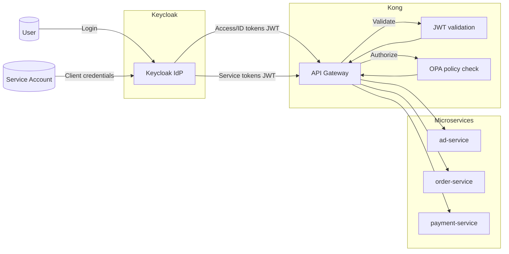
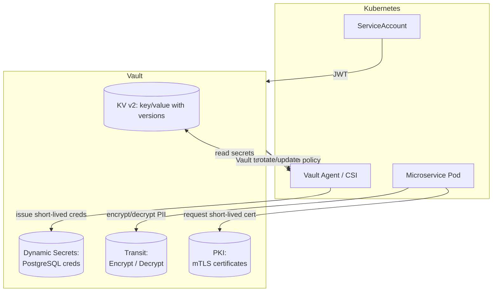

## 1) Аутентификация и авторизация

 **Механизм**
- **Протокол**: **OAuth 2.1 + OpenID Connect (OIDC)**.
	- так как OAuth2.1/OIDC - стандарт для браузеров/мобильных клиентов
	- JWT (подписанные токены) — формат для `access_token`/`id_token` (подпись RS256/ES256)
	- Почему не SAML: SAML рассчитан в основном на браузерные SSO-сценарии старого типа, неудобен для SPA/мобилок и межсервисных вызовов.
	- почему с OIDC: даёт id_token для подтверждения личности и access_token для доступа к API; работает с короткоживущими токенами и ротацией ключей
 
 **Потоки аутентификации**
- Для веб/мобильных клиентов - **Authorization Code + PKCE** (без implicit/password)
	- **PKCE** защищает от перехвата кода (например, в мобильных приложениях)
	- **Почему не implicit/password:** implicit устарел и небезопасен (токен в URL), password-грант запрещён гайдлайнами (пароли не «гуляют» вне IdP).

- Для межсервисных вызовов - **Client Credentials**.
	- сервису выдан client_id и client_secret
	- он получает **сервисный токен** у IdP
	-  этот токен прикладывается к gRPC/REST вызовам между сервисами
	- токен имеет короткий TTL (несколько минут), обновляется автоматически.
	- Client Credentials упрощает и делает безопасными сервис-к-сервису вызовы.

**Токены и ключи**
- **access token** - JWT, даёт доступ к API, TTL 5-15 минут
- id token - JWT, данные о пользователе (клиенте), сохраняется на фронте/сервере и не пересылается в другие сервисы
- **refresh token** - для обновления access token, хранится в httpOnly+Secure cookie, TTL сутки + ротация

- **Хранилище ключей**: JWKS-эндпоинт; ключи подписания с **rotation** (kid), секреты - в Vault.
- **Где проверяем**: на **API-шлюзе** (ингресс) и в сервисах (lib/sidecar).
	- Проверка `access_token` на входе: подпись по **JWKS**, базовые поля (`iss`, `aud`, `exp`), проверка `scope/role`
	- Непрошедшие запросы не доходят до микросервисов.
- **Модель прав**: **гибрид RBAC + ABAC** (роли + атрибуты/условия), движок политик - **OPA (Open Policy Agent)**. Кеш политик в Redis.
	- **RBAC** — базовая модель (роль `USER/SELLER/MODERATOR/ADMIN/SERVICE` в `roles` токена).
	- **ABAC (через OPA)** — когда нужны «условные» правила: «только владелец объявления может его менять», «модератор только своей категории» и т.п.
	    - Правила в Git (Rego), CI-тесты политик, доставка на шлюз.
	    - Запрос: шлюз отправляет в OPA контекст (кто/куда/что), ответ — allow/deny.

#### потоки выдачи токенов
**1. Пользователь: Authorization Code + PKCE (OIDC)**
- Клиент инициирует авторизацию: редирект на `/authorize` Keycloak с параметрами  
    `response_type=code`, `client_id=web-frontend`, `redirect_uri`, `scope=openid profile offline_access`, `state`,  
    `code_challenge=S256(code_verifier)`, `code_challenge_method=S256`, `nonce`.
- Пользователь логинится (и MFA, если включено).
- Keycloak редиректит на `redirect_uri?code=...&state=...`.
- Сервер обменивает **code** на **токены** на `/token`, передавая `code_verifier`.  
    Ответ:
    - **access_token** (JWT, 5–15 мин),
    - **id_token** (для фронта/профиля),
    - **refresh_token** (для обновления, живёт дольше).
- Фронт делает запросы к API с `Authorization: Bearer <access_token>`  
    (**refresh** держим только в httpOnly+Secure cookie).
- Обновление токена: запрос `grant_type=refresh_token` → выдаётся новый access и **новый refresh** (ротация, «reuse detection»).

**Сервис-сервис: Client credentials**
- Сервис-клиент обращается к `/token` Keycloak с `grant_type=client_credentials`, аутентифицируясь как клиент  
- Получает **access_token** (JWT, 3–10 мин) со своими `client_id`, `aud`, `scope`.
- Прикладывает токен к gRPC/HTTP вызову.
- На стороне целевого API шлюз/ингресс проверяет токен (см. ниже).
#### валидация токенов
**Что проверяем**
- **Подпись**: из заголовка JWT берём `kid`, запрашиваем/кэшируем публичный ключ из **JWKS** (`/.well-known/jwks.json`) и проверяем подпись, `alg` (RS256/ES256).
-  **Стандартные поля**:
    - `iss` — строго URI нашего Keycloak;
    - `aud` — включает конкретный API;
    - `exp`/`nbf`/`iat` — валидные временные метки (с учётом clock skew);
    - `azp`/`client_id` — по ситуации.
- **Права**: `scope`/`roles`. Маршруты в шлюзе защищены соответствующими ролями/скоупами.
-  **Тонкие правила (по необходимости)**: запрос к **OPA** с контекстом (метод, путь, субъект, ID ресурса), OPA возвращает allow/deny.
-  **Отзыв**: для срочных блокировок поддерживаем **deny-list по `jti`** в Redis до истечения `exp` (применяется редко).
- **Аудит**: логируем успешные/ошибочные проверки, добавляем `trace_id`.

**Где это находится**
- На **API-шлюзе** (Kong) — готовые плагины/фильтры JWT + ext_authz к OPA.
- В сервисах остаётся минимум логики (или вовсе нет) — важна единообразная точка отказа.
#### Архитектура с учётом экспирации и обновления токенов

**Сроки жизни**
- `access_token`: 5–15 минут (короткий).
- `refresh_token`: часы/дни, **ротация при каждом обновлении** (включаем «reuse detection» в Keycloak).
	- веб-пользователь (браузер) - 7 дней 
	- мобильное приложение - 30 дней (т.к. реже перезаходят)
	- сервис к сервису  - без refresh (access-токен выдается заново по client_id)
	- админы и другие критичные роли - 24 часа
- сервисные `client_credentials` токены: **3–10 минут**.

**Обновление**
- Веб/SPA: автоматическое обновление access через `refresh_token` (BFF хранит refresh в httpOnly cookie).
- Мобилки: SDK вызывает `/token` по `refresh_token` перед истечением.
- Сервисы: получают новые токены программно (кэш внутри клиента, перезапрос по истечении).

**Logout/отзыв**
- Завершаем сессию в Keycloak (отзываем **refresh**).
- Для активных access-токенов — при необходимости добавляем `jti` в deny-list до `exp`.
- Изменение ролей/политик: новые токены немедленно отражают изменения, старые живут до `exp` (или форс-ревок).

**Ошибки и деградация**
- Просрочен/битый токен → 401/403 на шлюзе, фронт инициирует refresh или логин.
- Keycloak недоступен:
    - **проверка JWT не ломается** (локальная верификация по JWKS),
    - недоступно только «получить/обновить» токен → система работает у уже аутентифицированных до истечения access.

---
## 2) Безопасность передачи данных
> Цель: Защитить данные **между клиентами и API** (внешний периметр) и **между микросервисами** (внутри кластера).
> + Минимизировать риски перехвата/подмены, утечки секретов и PII.
> + Сохранять работоспособность со старыми клиентами, но по умолчанию использовать современные протоколы.

**Что выбираем**
- **TLS 1.2/1.3** (1.2 для совместимости со старыми клиентами)
- Шифры: **AES-GCM** и **ChaCha20-Poly1305** (TLS 1.3 их выбирает автоматически).
- Сертификаты:
	- **ECDSA P-256** (короче, быстрее) - если уверены, что клиенты поддерживают ECDSA.
	- **RSA 2048/3072** - нужна максимальная совместимость со старыми клиентами.
- **HSTS** - жёсткое указание браузеру не сваливаться на HTTP, а обращаться только по HTTPS
- **mTLS** для внутреннего трафика (east-west) через **service mesh**
	- автоматический mTLS между подами (прозрачно для кода), централизованная ротация внутренних сертификатов (ttl дни)
- **Шифрование «поверх TLS»** для чувствительных полей (PII) — **Vault Transit (AES-GCM 256)**, envelope-подход.

**Что шифруем дополнительно**
- Персональные поля (паспорт/ИНН, адреса, телефоны), 
	- **Шифрование полей** в БД: **AES-256-GCM** 
- **Токены интеграций, API-ключи партнёров, refresh-токены**: храним **только в зашифрованном виде** (AES-256-GCM), доступ через Vault.
- **Пароли** пользователей: **хэшируются**: **Argon2id** + соль индивидуально
- **Платёжные данные**: по возможности **не хранить**. Использовать **токенизацию платёжного провайдера**.
- **Логи и бэкапы**: шифрование на уровне файлов/томов (LUKS/dm-crypt) + исключение персональных данных из логов.

---
## 3) Управление доступами (RBAC/ABAC)

**Что выбираем**
- **RBAC**: роли `ADMIN`, `USER`, `SELLER`, `MODERATOR`, `SERVICE`.
- **ABAC**: политики «владелец ресурса», «организация/регион», «в рабочее время», «статус объекта».
- **Движок**: **OPA** (Rego) или аналог (Cedar/OPA-подобный), хранение политик в Git (GitOps), доставка — через CI/CD.

**Процессы**
- Создание/изменение ролей — через административный UI, изменения политик — PR в репозиторий политик (code review + авто-тесты).
- Периодическая **ревизия доступов** (access review), отчёты по отклонениям.
- Автоматическая проверка политик в CI (unit-тесты на Rego, тестовые кейсы на реальные объекты).

**Почему**
- RBAC закрывает «грубые» уровни, ABAC даёт тонкую грануляцию без взрывного роста ролей.
- GitOps для политик = трассируемость и контроль изменений.

---
## 4) Хранение и управление секретами

**Что выбираем**
- **HashiCorp Vault**:
    - **Kubernetes auth** (токен ServiceAccount передаётся в Vault, получаем в ответ Vault policy).
    - **KV v2** - хранилище ключ-значение для конфиг-секретов
    - Dynamic Secrets — «временные» логины/пароли, которые Vault создаёт «на лету»
    - Transit — «криптограф как сервис» 
	    - Transit создаёт ключи шифрования и даёт API: «зашифруй/расшифруй/подпиши/проверь подпись»
	- Внутренние короткоживущие сертификаты для mTLS можно выдавать через Vault PKI
    - **Auto-unseal**, аудит (журналы).
- Интеграция: **Vault Agent Injector / CSI** для подстановки секретов в поды.

**Ротация/шифрование конфигов**
- Регламент ротации: API-ключи - 90 дней, JWT-ключи - 30–60 дней, DB-пароли - динамически (часы).
- Конфиги в Git - без секретов; используем SOPS или шаблоны, секреты подтягиваются на деплое из Vault.
- Ключи шифрования хранятся в Vault; приложения вызывают Transit для шифр/дешифр.

**Почему**
- Vault даёт централизованный контроль, краткоживущие креды и трассируемость доступа.
### Сценарий А: сервису нужен пароль к БД
1. Поду `ad-service` выдан SA `ad-service`.
2. При старте Agent Injector логинится в Vault через **Kubernetes auth** → получает Vault Token с политикой `ad-service`.
3. Агент читает `database/creds/ad_service_ro` → получает **динамический логин/пароль** в Postgres на 1 час → кладёт в `/vault/secrets/db.env`.
4. Приложение читает `/vault/secrets/db.env` и подключается к БД.
5. Через 50 минут агент обновит секрет; приложение перечитает (горячо) или получит новый пул соединений.
### Сценарий Б: шифруем паспорт в профиле пользователя

1. `user-service` отправляет `POST /transit/encrypt/pii` с полем `passport: 1234 567890`.
2. Vault возвращает `ciphertext: vault:v1:AAECA...`.
3. Приложение сохраняет `ciphertext` в колонку `passport_enc`.
4. Для чтения — зеркальная операция `transit/decrypt/pii`.
### Сценарий В: ротация API-ключа партнёра

1. DevOps кладёт **новую версию** `kv/data/delivery-service/partner_api_key`.
2. Vault Agent обновляет файл в поде; `delivery-service` перечитывает ключ (сигнал или таймер).
3. Старая версия остаётся «для отката» (но сервис уже работает на новой).

---
## 5) Мониторинг и аудит безопасности

**Что собираем**
- **События аутентификации**: успешные/неуспешные логины, MFA, блокировки.
- **Авторизация**: отказы 403/401, срабатывания политик OPA (решения/вводные).
- **Доступ к чувствительным данным**: кто/когда/что, объём выгрузок.
- **Админ-действия**: смена ролей, публикация политик, изменения конфигов.
- **Секреты/Vault**: чтение/выдача/ротация, ошибки доступа.
- **TLS/mTLS**: ошибки рукопожатий, истечение сертификатов.
- **Аномалии**: нехарактерные IP/гео, частые ошибки входа, резкий рост выдач данных.

**Инструменты**
- **Prometheus/Grafana** — метрики доступа/ошибок.
- **ELK/Loki** — централизованные логи (структурированные, с `trace_id`, `user_id`).
- **OpenTelemetry + Jaeger** — трассировка с «безопасными» спанами (без PII).
- **SIEM** (Wazuh/Splunk/ELK-SIEM) — корреляция событий, правила оповещений.
- **Alertmanager** — алерты: рост 401/403, всплеск логинов, падение мTLS, аномальный `data export`.

**Почему**
- Видимость и трассируемость — единственный способ быстро ловить утечки и инсайдеров, плюс требования комплаенса.